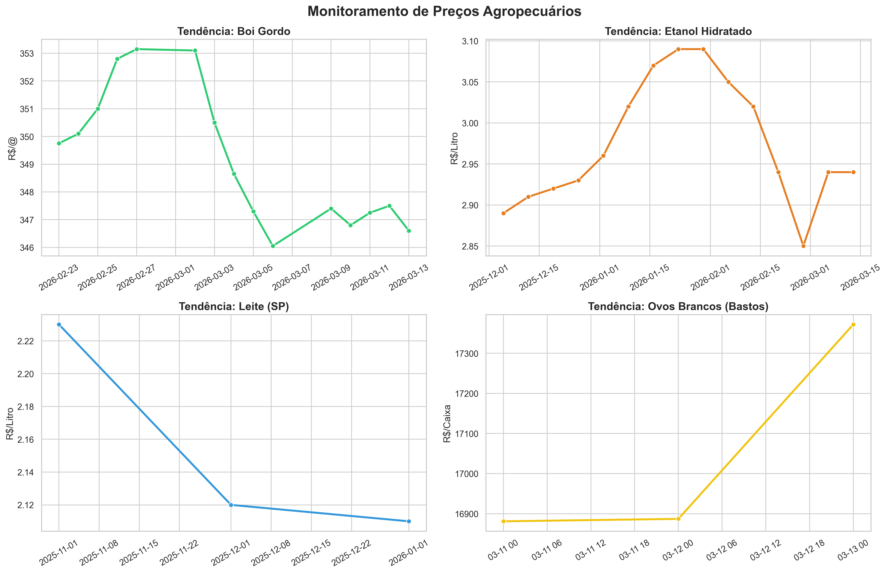

# 📊 Dashboard de Inteligência de Mercado: Agronegócio (CEPEA)


## 🎯 Sobre o Projeto
Este projeto foi desenvolvido para automatizar a análise de preços das principais commodities agropecuárias da região. Utilizando dados brutos do **CEPEA/Esalq-USP**, o sistema limpa, normaliza e gera um painel visual para suporte à decisão.

O maior diferencial deste projeto é a **capacidade de tratamento de dados heterogêneos**, transformando diferentes formatos de data e escalas de preço em uma série temporal unificada.

---

## 🛠️ Desafios Técnicos Superados

Na etapa de **ETL (Extract, Transform, Load)**, foram implementadas soluções para:

* **Normalização de Séries Temporais**: 
    * Conversão de datas semanais (Etanol) e mensais em português (Leite, ex: `jan/26`) para objetos `datetime` padronizados.
* **Ajuste Dinâmico de Escala**: 
    * Correção de erros de precisão decimal onde valores eram lidos como inteiros (ex: convertendo `34660` para `R$ 346,60`).
* **Filtro Geográfico Inteligente**: 
    * Seleção automática de dados de **São Paulo** e microrregiões específicas (como o polo avícola de **Bastos/SP**).

---

## 📈 Resultados: Painel de Monitoramento

O resultado final é um dashboard consolidado que permite a visualização de tendências mesmo com produtos de diferentes grandezas de valor.

> [!TIP]
> **Insights do Painel:** Observe as flutuações de preços no primeiro trimestre de 2026, com o Etanol e o Boi Gordo apresentando correlação em seus períodos de pico.

### Visualização do Dashboard


---

## 📂 Estrutura do Repositório

| Arquivo | Função |
| :--- | :--- |
| `data/` | CSVs brutos baixados do CEPEA. |
| `processor.py` | Engine de limpeza e tratamento de dados. |
| `visualizer.py` | Script de geração do dashboard gráfico. |
| `data/limpos/` | Dados prontos para análise (Saída do ETL). |

---

## 🚀 Como Executar

1. Clone o repositório:
   ```bash
   git clone [https://github.com/seu-usuario/seu-repositorio.git](https://github.com/seu-usuario/seu-repositorio.git)

2. Instale as dependências:
pip install pandas seaborn matplotlib

3. Rode o processamento e a visualização:

python processor.py && python visualizer.py

💡 Projeto desenvolvido como parte do portfólio de Análise de Dados.

